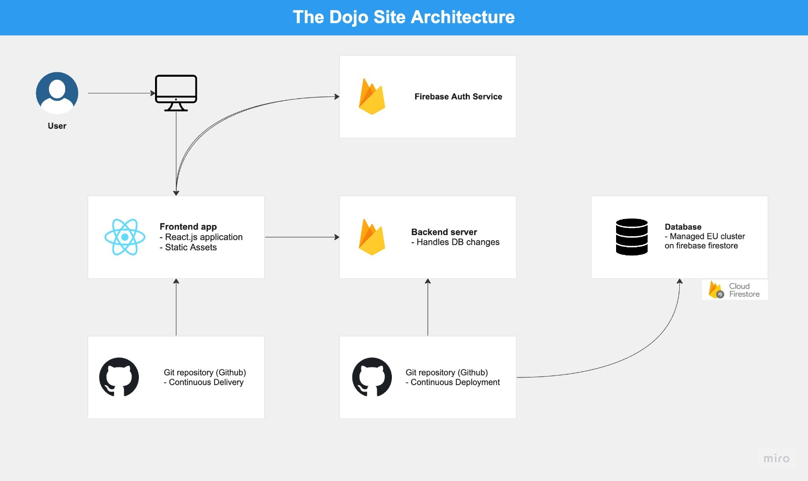

# The Dojo Site

This is my university's frontend module hand-in project for fall semester 2022.

[Click here to see it in production](https://the-dojo-site-react.web.app/)
#### Technologies

This application is written using the folowing stack:

- `React.js`
- `Vanilla Css`
- `Firebase Auth`
- `Firestore (DB)`

#### System requirements

- Docker
- Docker Compose
- Node 16 (I recommend using `nvm` to support multipul Node.js versions)

#### Installation Instructions

Before we get started, make sure you are running Node 16:

```
node --version # should output something similar to to v16.x.x
```

In case you are using nvm, switch to the right version by typing the following command.

`nvm use 16`

Now that we know we are running on the right environment, let's sping up the app.

#### Developing with the last stable release

`docker-compose up`

By now you should be able to open `http://localhost:3000` in your browser to see the application running.

#### Folder Structure

To make it easy for new developers to navigate through our codebase, we provided you with a short explanation on why we split our code the way we do.

In a nutshell, our application is organized as follows.

```
src/
     assests/  # All the static assets required
     components/ # Presentational components
     pages/ # Page components
     hooks/ # Custom React Hooks
     context/ # All of the context funcitonalities
     firebase/ # Firebaseconfigurations
```

#### Architecture Overview

In the following diagram you can see the basic flow of the app:


#### Deployment workflows

Currently there are 2 github actions pipelines:

- `Integration` - triggred for every PR made to any branch: will handle all the code formatting and testing to make sure everything is unified in the code.

- `Deployment` - triggred with every push to master: will handle building the applicaiton in an optimized way and deploying it to the prouction environment.
